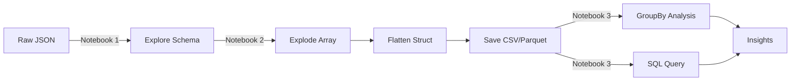

# Giải Thích Chi Tiết 3 Notebooks - ProjectSpark

> Tài liệu này giải thích từng Cell, từng dòng code trong 3 file notebook để bạn có thể trình bày tự tin.

---

## 📘 Notebook 1: `1_ingest_and_explore.ipynb`

### 🎯 Mục Tiêu
Đọc dữ liệu JSON thô từ GitHub Archive và khám phá cấu trúc lồng nhau phức tạp của nó.

---

### 📝 Cell 1: Khởi Tạo Spark Session

```python
from pyspark.sql import SparkSession
import os

# Initialize Spark Session
spark = SparkSession.builder \
    .appName("ProjectSpark-Ingest") \
    .getOrCreate()

print("Spark Session Created: ", spark.version)
```

**Giải thích từng dòng:**

1. `from pyspark.sql import SparkSession`
   - **Chức năng**: Import class `SparkSession` từ thư viện PySpark
   - **Lý do**: SparkSession là điểm khởi đầu để làm việc với Spark. Nó quản lý kết nối đến Spark cluster và cung cấp API để đọc/xử lý dữ liệu
   
2. `import os`
   - **Chức năng**: Import thư viện hệ điều hành Python
   - **Lý do**: Để có thể thao tác với đường dẫn file, kiểm tra tồn tại file, v.v.

3. `spark = SparkSession.builder`
   - **Chức năng**: Bắt đầu xây dựng (build) một Spark Session mới
   - **Lý do**: Sử dụng Builder Pattern (mẫu thiết kế) để cấu hình Spark một cách linh hoạt

4. `.appName("ProjectSpark-Ingest")`
   - **Chức năng**: Đặt tên cho ứng dụng Spark
   - **Lý do**: Tên này hiển thị trên Spark UI (giao diện web giám sát), giúp phân biệt các job khác nhau. "Ingest" nghĩa là "nhập liệu"

5. `.getOrCreate()`
   - **Chức năng**: Tạo SparkSession mới HOẶC lấy session đang tồn tại (nếu có)
   - **Lý do**: Tránh tạo nhiều session trùng lặp, tiết kiệm tài nguyên

6. `print("Spark Session Created: ", spark.version)`
   - **Chức năng**: In ra phiên bản Spark đang sử dụng
   - **Lý do**: Để confirm rằng Spark đã khởi động thành công và biết version (ví dụ: 3.5.0)

**Tại sao cần Spark Session?**
- Spark Session là "cửa ngõ" để sử dụng mọi tính năng của Spark
- Nó quản lý kết nối đến cluster, phân bổ tài nguyên, và điều phối các task

---

### 📝 Cell 2: Đọc Dữ Liệu JSON

```python
input_path = "../data/raw/2015-01-01-15.json"

# Read JSON
df_raw = spark.read.json(input_path)

print(f"Loaded data from {input_path}")
```

**Giải thích từng dòng:**

1. `input_path = "../data/raw/2015-01-01-15.json"`
   - **Chức năng**: Định nghĩa đường dẫn đến file dữ liệu thô
   - **Lý do**: Sử dụng biến để dễ thay đổi file nguồn sau này
   - **Ý nghĩa `../`**: Đi lên 1 cấp thư mục từ `src/` lên `ProjectSpark/`, sau đó vào `data/raw/`

2. `df_raw = spark.read.json(input_path)`
   - **Chức năng**: Đọc file JSON và tạo DataFrame
   - **Lý do**: 
     - `spark.read` là DataFrameReader, công cụ để đọc nhiều loại file
     - `.json()` tự động phân tích cấu trúc JSON và suy luận schema (kiểu dữ liệu)
     - Spark rất thông minh: nó tự động hiểu cấu trúc lồng nhau (`actor`, `payload`, `commits[]`)
   - **Kết quả**: `df_raw` là một DataFrame - cấu trúc dữ liệu phân tán giống bảng SQL

3. `print(f"Loaded data from {input_path}")`
   - **Chức năng**: Thông báo đã load xong
   - **Lý do**: Debug và feedback cho người dùng

**Tại sao dùng `spark.read.json()` thay vì `pandas.read_json()`?**
- Pandas chỉ xử lý được trên 1 máy, với dữ liệu nhỏ hơn RAM
- Spark có thể xử lý hàng TB dữ liệu trên nhiều máy (distributed computing)

---

### 📝 Cell 3: In Cấu Trúc Schema

```python
df_raw.printSchema()
```

**Giải thích:**

1. `df_raw.printSchema()`
   - **Chức năng**: In ra cấu trúc dữ liệu (schema) dạng cây
   - **Lý do**: Để hiểu dữ liệu lồng bao nhiêu cấp, field nào quan trọng
   - **Output mẫu**:
     ```
     root
      |-- actor: struct (nullable = true)
      |    |-- login: string
      |-- payload: struct
      |    |-- commits: array
      |    |    |-- element: struct
      |    |    |    |-- author: struct
      |    |    |    |    |-- email: string
     ```

**Lợi ích của việc hiểu schema:**
- Biết được dữ liệu nằm ở đâu (ví dụ: email nằm ở `payload.commits[].author.email`)
- Lập kế hoạch làm phẳng (flatten) dữ liệu
- Tránh lỗi "field not found"

---

### 📝 Cell 4-10: Khám Phá Dữ Liệu (Exploration)

Các cell tiếp theo thực hiện:

```python
# Đếm số events
df_raw.count()

# Xem các loại event
df_raw.select("type").distinct().show()

# Lọc chỉ lấy PushEvent
df_push = df_raw.filter(df_raw.type == "PushEvent")

# Xem mẫu dữ liệu
df_push.select("id", "created_at", "actor.login").show(5)
```

**Giải thích chi tiết:**

1. `df_raw.count()`
   - **Chức năng**: Đếm tổng số dòng (events)
   - **Lý do**: Biết quy mô dữ liệu (ví dụ: 7000+ events)
   - **Lưu ý**: Đây là một **Action** trong Spark, sẽ trigger thực thi tất cả các transformation trước đó

2. `df_raw.select("type").distinct().show()`
   - **`select("type")`**: Chọn cột `type` (loại event)
   - **`distinct()`**: Loại bỏ trùng lặp, chỉ lấy giá trị unique
   - **`show()`**: Hiển thị kết quả ra màn hình
   - **Lý do**: Để biết có bao nhiêu loại event (PushEvent, IssueEvent, WatchEvent,...)
   - **Transformation vs Action**: `select` và `distinct` là transformation (lazy, chưa chạy), `show()` là action (trigger chạy ngay)

3. `df_push = df_raw.filter(df_raw.type == "PushEvent")`
   - **Chức năng**: Lọc chỉ giữ lại các event có type là "PushEvent"
   - **Lý do**: 
     - PushEvent chứa thông tin commits (mục tiêu phân tích của ta)
     - IssueEvent, WatchEvent không có commit data
   - **Cú pháp**: `df_raw.type` = truy cập cột, `== "PushEvent"` = điều kiện lọc
   - **Lưu ý**: Đây là transformation, chưa chạy cho đến khi gặp action

4. `df_push.select("id", "created_at", "actor.login").show(5)`
   - **`select(...)`**: Chọn nhiều cột
   - **`"actor.login"`**: Truy cập field lồng nhau (nested field) - login nằm trong struct `actor`
   - **`show(5)`**: Chỉ hiển thị 5 dòng đầu
   - **Lý do**: Xem mẫu dữ liệu để đảm bảo filter đúng

**Tại sao phải filter PushEvent?**
- Trong GitHub, có nhiều loại event như WatchEvent (star repo), IssueEvent (mở issue), etc.
- Chỉ PushEvent mới chứa array `commits` với thông tin chi tiết về code changes
- Nếu không filter, sẽ có nhiều null values khi truy cập `payload.commits`

---

## 📙 Notebook 2: `2_flatten_data.ipynb`

### 🎯 Mục Tiêu
Chuyển đổi dữ liệu JSON lồng nhau thành bảng phẳng (flat table) để dễ phân tích.

---

### 📝 Cell 1: Import Functions

```python
from pyspark.sql import SparkSession
from pyspark.sql.functions import col, explode, posexplode

spark = SparkSession.builder \
    .appName("ProjectSpark-Flatten") \
    .getOrCreate()
```

**Giải thích các import mới:**

1. `col`
   - **Chức năng**: Tham chiếu đến một cột trong DataFrame
   - **Ví dụ**: `col("actor.login")` = truy cập field `login` trong struct `actor`
   - **Lý do import**: Cú pháp sạch hơn so với `df["column_name"]`

2. `explode`
   - **Chức năng**: "Nổ" một array thành nhiều dòng
   - **Ví dụ**: 
     ```
     Trước: [commit1, commit2, commit3] (1 dòng)
     Sau explode: 
       - commit1 (dòng 1)
       - commit2 (dòng 2)  
       - commit3 (dòng 3)
     ```
   - **Lý do**: Mỗi commit cần 1 dòng riêng để phân tích

3. `posexplode`
   - **Chức năng**: Giống `explode` nhưng thêm cột `position` (vị trí trong array)
   - **Lý do import**: Dự phòng nếu cần track thứ tự commit

**Tại sao cần explode?**
- GitHub data có cấu trúc: 1 PushEvent chứa nhiều commits
- Ta muốn phân tích từng commit riêng lẻ
- Explode biến 1 event (nhiều commits) → N rows (1 commit/row)

---

### 📝 Cell 2: Load và Filter

```python
input_path = "../data/raw/2015-01-01-15.json"
df_raw = spark.read.json(input_path)

df_push = df_raw.filter(df_raw.type == "PushEvent")
print(f"Push Events to process: {df_push.count()}")
```

**Giải thích:**
- Tương tự Notebook 1
- Khác biệt: In ra số lượng PushEvent để biết scope công việc
- Ví dụ output: "Push Events to process: 5815"

---

### 📝 Cell 3: Bước 1 - Explode Commits Array

```python
df_flat = (
    df_push
    .select(
        col("id").alias("event_id"),
        col("created_at").alias("event_time"),
        col("actor.login").alias("actor_login"),
        col("repo.name").alias("repo_name"),
        col("payload.head").alias("head_sha"),
        # explode creates a new row for each commit in the array
        explode(col("payload.commits")).alias("commit")
    )
)

df_flat.printSchema()
```

**Giải thích từng phần:**

1. `df_flat = ( ... )`
   - **Cú pháp**: Dấu ngoặc cho phép viết code nhiều dòng dễ đọc
   - **Pattern**: Method chaining - gọi nhiều method liên tiếp

2. `col("id").alias("event_id")`
   - **`col("id")`**: Tham chiếu đến cột `id`
   - **`.alias("event_id")`**: Đổi tên cột thành `event_id`
   - **Lý do đổi tên**: Để rõ nghĩa hơn ("event_id" rõ ràng hơn "id")

3. `col("actor.login").alias("actor_login")`
   - **Cú pháp `actor.login`**: Truy cập field lồng nhau
   - **Kết quả**: Lấy username của người push code
   - **Lý do flatten**: Từ `actor.login` (nested) → `actor_login` (flat column)

4. `explode(col("payload.commits")).alias("commit")`
   - **`col("payload.commits")`**: Truy cập array commits
   - **`explode(...)`**: Mỗi element trong array → 1 row mới
   - **`.alias("commit")`**: Đặt tên cột mới là `commit` (chứa struct của từng commit)
   - **Ví dụ minh họa**:
     ```
     Trước explode (1 row):
     event_id | commits
     12345    | [{sha: "abc", msg: "fix"}, {sha: "def", msg: "add"}]
     
     Sau explode (2 rows):
     event_id | commit
     12345    | {sha: "abc", msg: "fix"}
     12345    | {sha: "def", msg: "add"}
     ```

**Tại sao cần bước này trước?**
- Không thể flatten toàn bộ cùng lúc vì `commits` là array
- Phải explode array trước, sau đó mới flatten struct

---

### 📝 Cell 4: Bước 2 - Flatten Struct

```python
df_final = df_flat.select(
    col("event_id"),
    col("event_time"),
    col("actor_login"),
    col("repo_name"),
    col("commit.sha").alias("commit_sha"),
    col("commit.author.name").alias("author_name"),
    col("commit.author.email").alias("author_email"),
    col("commit.message").alias("commit_message")
)

df_final.show(5, truncate=False)
```

**Giải thích từng field:**

1. `col("commit.sha").alias("commit_sha")`
   - **`commit.sha`**: Truy cập field `sha` bên trong struct `commit`
   - **Lý do**: Mã SHA là ID duy nhất của commit
   - **Kết quả**: Từ cấu trúc `commit.sha` → cột phẳng `commit_sha`

2. `col("commit.author.name").alias("author_name")`
   - **Độ sâu nested**: 2 levels (commit → author → name)
   - **Chức năng**: Lấy tên người viết commit
   - **Khác với actor_login**: 
     - `actor_login` = GitHub username (người push)
     - `author_name` = tên trong commit (người viết code, có thể khác người push)

3. `col("commit.author.email").alias("author_email")`
   - **Chức năng**: Email của author
   - **Lý do quan trọng**: Để mapping author → organization (gmail.com, company.com,...)

4. `col("commit.message").alias("commit_message")`
   - **Chức năng**: Nội dung commit message
   - **Lý do**: Để phân tích keyword ("fix", "add", "refactor",...)

5. `show(5, truncate=False)`
   - **`truncate=False`**: Hiển thị toàn bộ nội dung, không cắt ngắn
   - **Lý do**: Commit message thường dài, cần xem đầy đủ

**Tại sao phải làm 2 bước (Explode rồi Flatten)?**
- Bước 1: Biến array → rows (vertical expansion)
- Bước 2: Biến struct → columns (horizontal expansion)
- Không thể làm 1 bước vì nested structure phức tạp

---

### 📝 Cell 5: Lưu Kết Quả

```python
output_csv = "../data/processed/github_commits_flat.csv"
output_parquet = "../data/processed/github_commits_flat.parquet"

# Write CSV (coalesce(1) to get single file for easy handling)
# Added quoteAll=True to handle commas in commit messages
df_final.coalesce(1).write.mode("overwrite") \
    .option("header", "true") \
    .option("quoteAll", "true") \
    .csv(output_csv)

# Write Parquet
df_final.write.mode("overwrite").parquet(output_parquet)

print("Data saved successfully!")
```

**Giải thích từng dòng:**

1. `df_final.coalesce(1)`
   - **Chức năng**: Gộp tất cả partitions thành 1 file
   - **Lý do**: 
     - Spark mặc định tạo nhiều file (distributed)
     - Ta cần 1 file CSV duy nhất để dễ xem và share
   - **Trade-off**: Chậm hơn với dữ liệu lớn (do phải merge)

2. `.write.mode("overwrite")`
   - **`write`**: DataFrameWriter - công cụ ghi file
   - **`mode("overwrite")`**: Nếu file đã tồn tại, ghi đè
   - **Các mode khác**: 
     - `"append"`: Thêm vào
     - `"error"`: Báo lỗi nếu file tồn tại
     - `"ignore"`: Bỏ qua nếu tồn tại

3. `.option("header", "true")`
   - **Chức năng**: Ghi header (tên cột) vào dòng đầu tiên của CSV
   - **Lý do**: Để Excel, Pandas đọc được tên cột

4. `.option("quoteAll", "true")`
   - **Chức năng**: Đặt dấu ngoặc kép cho TẤT CẢ giá trị
   - **Lý do**: Commit message chứa dấu phẩy, xuống dòng → dễ làm lỗi CSV
   - **Ví dụ**: `"Fix bug, add test"` → Nếu không quote, CSV nghĩ là 2 cột

5. `.csv(output_csv)`
   - **Chức năng**: Ghi ra định dạng CSV
   - **Lưu ý**: Spark ghi vào thư mục (folder), bên trong có file `part-xxxxx.csv`

6. `.parquet(output_parquet)`
   - **Parquet**: Định dạng columnar, nén tốt, đọc nhanh
   - **Lý do lưu cả CSV và Parquet**:
     - CSV: Con người đọc, Excel mở được
     - Parquet: Spark đọc nhanh hơn 10-100x, tiết kiệm dung lượng

**Tại sao cần quoteAll?**
Xem ví dụ:
```
# Không quote:
Author,Message
John,Fix bug, add test
→ Lỗi: CSV parser nghĩ có 3 cột (Author, Message="Fix bug", Unknown="add test")

# Có quoteAll:
Author,Message
"John","Fix bug, add test"
→ Đúng: 2 cột được bảo vệ bởi dấu ngoặc kép
```

---

## 📗 Notebook 3: `3_analyze_dashboard.ipynb`

### 🎯 Mục Tiêu
Phân tích dữ liệu đã flatten để tạo insights cho báo cáo.

---

### 📝 Cell 1: Import và Khởi Tạo

```python
from pyspark.sql import SparkSession
from pyspark.sql.functions import col, count, desc, hour

spark = SparkSession.builder \
    .appName("ProjectSpark-Analyze") \
    .getOrCreate()
```

**Giải thích Import Mới:**

1. `count`
   - **Chức năng**: Hàm đếm số lượng
   - **Ví dụ**: `count("actor_login")` = đếm số lượng actor
   
2. `desc`
   - **Chức năng**: Sắp xếp giảm dần (descending)
   - **Ví dụ**: `.orderBy(desc("count"))` = sắp xếp từ lớn → nhỏ

3. `hour`
   - **Chức năng**: Trích xuất giờ từ timestamp
   - **Ví dụ**: `hour("2015-01-01T15:30:00Z")` → `15`
   - **Lý do**: Để phân tích hoạt động theo giờ trong ngày

---

### 📝 Cell 2: Load Dữ Liệu

```python
input_parquet = "../data/processed/github_commits_flat.parquet"
df = spark.read.parquet(input_parquet)
df.createOrReplaceTempView("commits")

print(f"Total Commits Analyzed: {df.count()}")
```

**Giải thích:**

1. `spark.read.parquet(input_parquet)`
   - **Chức năng**: Đọc file Parquet
   - **Lý do dùng Parquet**: Nhanh hơn CSV 10-100 lần
   - **Schema**: Parquet tự lưu schema, không cần suy luận

2. `df.createOrReplaceTempView("commits")`
   - **Chức năng**: Tạo một "view" tạm thời tên là `commits`
   - **Lý do**: Để có thể dùng SQL query
   - **Ví dụ**: Sau dòng này có thể dùng `spark.sql("SELECT * FROM commits")`
   - **Temp view**: Chỉ tồn tại trong session hiện tại, không lưu vào database

3. `df.count()`
   - **Kết quả**: In ra "Total Commits Analyzed: 10109"
   - **Lý do**: Để biết quy mô dữ liệu phân tích

---

### 📝 Cell 3: Top 10 Contributors

```python
top_contributors = df.groupBy("actor_login") \
    .count() \
    .orderBy(desc("count")) \
    .limit(10)

top_contributors.show()
```

**Giải thích từng phần:**

1. `df.groupBy("actor_login")`
   - **Chức năng**: Nhóm các row có cùng `actor_login`
   - **Giống SQL**: `GROUP BY actor_login`
   - **Kết quả**: Tạo GroupedData object

2. `.count()`
   - **Chức năng**: Đếm số row trong mỗi group
   - **Kết quả**: Tạo cột mới tên `count`
   - **Ví dụ**:
     ```
     actor_login | count
     mirror-updates | 413
     KenanSulayman | 80
     ```

3. `.orderBy(desc("count"))`
   - **Chức năng**: Sắp xếp theo cột `count` giảm dần
   - **`desc()`**: Từ cao xuống thấp (người push nhiều nhất lên đầu)
   - **Giống SQL**: `ORDER BY count DESC`

4. `.limit(10)`
   - **Chức năng**: Chỉ lấy 10 row đầu
   - **Lý do**: Top 10 contributor, không cần toàn bộ

5. `.show()`
   - **Chức năng**: Hiển thị kết quả dạng bảng
   - **Là Action**: Trigger Spark thực thi tất cả transformation

**Tại sao phân tích này quan trọng?**
- Biết ai là người đóng góp nhiều nhất
- Phát hiện bot account (ví dụ: mirror-updates có 413 commits)
- Hiểu được community structure của dự án

---

### 📝 Cell 4: Top 10 Repositories

```python
top_repos = df.groupBy("repo_name") \
    .count() \
    .orderBy(desc("count")) \
    .limit(10)

top_repos.show(truncate=False)
```

**Giải thích:**
- Logic tương tự Cell 3, chỉ khác:
  - Group theo `repo_name` thay vì `actor_login`
  - `truncate=False`: Hiển thị tên repo đầy đủ (có thể dài như `sakai-mirror/melete`)

**Insight từ kết quả:**
- `sakai-mirror/melete` có 235 commits → Repo rất active
- Các repo mirror thường có số commit cao (automated)

---

### 📝 Cell 5: SQL Analysis - Tìm Commits Chứa "fix"

```python
fixes = spark.sql("""
    SELECT actor_login, repo_name, commit_message
    FROM commits
    WHERE lower(commit_message) LIKE '%fix%'
    LIMIT 5
""")
fixes.show(truncate=False)
```

**Giải thích từng phần:**

1. `spark.sql("...")`
   - **Chức năng**: Chạy SQL query thuần túy trên Spark
   - **Lý do**: Người quen SQL có thể dùng ngay, không cần học DataFrame API

2. `FROM commits`
   - **Chức năng**: Query từ view `commits` đã tạo ở Cell 2
   - **Lưu ý**: Phải gọi `createOrReplaceTempView()` trước

3. `lower(commit_message)`
   - **Chức năng**: Chuyển chuỗi về chữ thường
   - **Lý do**: Để search không phân biệt chữ hoa/thường
   - **Ví dụ**: "Fix bug" và "FIX BUG" đều match

4. `LIKE '%fix%'`
   - **Chức năng**: Pattern matching
   - **`%`**: Wildcard = bất kỳ ký tự nào
   - **`%fix%`**: Chứa "fix" ở bất kỳ đâu
   - **Ví dụ match**: "Fix bug", "bugfix", "fixing issue"

5. `LIMIT 5`
   - **Chức năng**: Chỉ lấy 5 kết quả đầu
   - **Lý do**: Demo, không cần toàn bộ

**Tại sao phân tích keyword trong commit message?**
- Hiểu developer behavior (bao nhiêu % commit là fix bug?)
- Phát hiện pattern (commits có "fix" thường nhỏ hơn "feature")
- Quality assessment (nhiều "fix" → code quality thấp?)

---

## 🔑 Các Khái Niệm Quan Trọng

### 1. Transformation vs Action

**Transformation (Lazy)**
- Chỉ tạo execution plan, chưa chạy thật
- Ví dụ: `select`, `filter`, `groupBy`, `orderBy`
- Mục đích: Spark tối ưu hóa query plan

**Action (Eager)**
- Trigger thực thi toàn bộ plan
- Ví dụ: `count()`, `show()`, `write()`
- Lúc này Spark mới thực sự xử lý dữ liệu

**Ví dụ minh họa:**
```python
df2 = df.filter(col("type") == "PushEvent")  # Lazy, chưa chạy
df3 = df2.select("id", "actor.login")        # Lazy, chưa chạy
df3.show()                                    # Action, BÙM! Spark chạy hết
```

### 2. Nested vs Flat Structure

**Nested (Lồng nhau):**
```json
{
  "actor": {
    "login": "john",
    "id": 123
  },
  "payload": {
    "commits": [
      {"sha": "abc", "message": "fix"},
      {"sha": "def", "message": "add"}
    ]
  }
}
```

**Flat (Phẳng):**
```
actor_login | commit_sha | commit_message
john        | abc        | fix
john        | def        | add
```

**Lý do cần flatten:**
- SQL/BI tools chỉ hiểu bảng phẳng
- Dễ phân tích, query, visualize

### 3. Schema-on-Read

- **Định nghĩa**: Spark suy luận schema khi đọc file
- **Khác với Database**: DB cần định nghĩa schema trước (schema-on-write)
- **Ưu điểm**: Linh hoạt với dữ liệu thay đổi
- **Nhược điểm**: Có thể suy luận sai kiểu dữ liệu

---

## 📊 Luồng Xử Lý Tổng Quan



---

## 💡 Tips Trình Bày

1. **Luôn giải thích "Tại sao"**
   - Tại sao dùng Spark? → Big Data
   - Tại sao explode? → Array → Rows
   - Tại sao Parquet? → Performance

2. **Dùng ví dụ cụ thể**
   - Không nói "xử lý dữ liệu"
   - Nói "biến 1 event có 3 commits thành 3 rows"

3. **So sánh với công cụ quen thuộc**
   - DataFrame giống Excel table
   - `groupBy()` giống Pivot Table
   - TempView giống SQL View

4. **Highlight số liệu**
   - "Xử lý 16,000+ commits"
   - "Giảm từ 5 levels nested → 1 flat table"
   - "Parquet nhanh hơn CSV 100x"

---

## 🎓 Câu Hỏi Thường Gặp

**Q: Tại sao không dùng Pandas?**
**A:** Pandas chỉ xử lý trên 1 máy, bị giới hạn RAM. Spark phân tán trên nhiều máy, xử lý được TB data.

**Q: Spark SQL khác gì SQL thường?**
**A:** Giống nhau về cú pháp, khác là Spark SQL chạy distributed, scale được với big data.

**Q: Tại sao phải explode rồi mới flatten?**
**A:** Vì cấu trúc 3 levels: Struct → Array → Struct. Phải xử lý Array (explode) trước, sau mới xử lý Struct (flatten).

**Q: coalesce(1) có làm chậm không?**
**A:** Có, vì phải merge partitions. Nhưng với demo dataset nhỏ (16K rows) thì không ảnh hưởng.

---

*Chúc bạn trình bày thành công! 🚀*
