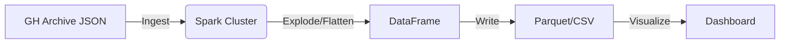

# BÁO CÁO ĐỒ ÁN: PHÂN TÍCH DỮ LIỆU JSON LỒNG NHAU VỚI SPARK
**Đề tài 25**: Phân tích dữ liệu JSON lồng nhau phức tạp (Complex Nested Data)

---

## 1. Phát biểu bài toán
Trong kỷ nguyên Big Data, dữ liệu thường được lưu trữ dưới dạng bán cấu trúc (Semi-structured), phổ biến nhất là JSON. Các hệ thống lớn như GitHub, Mobile Apps, Game Logs sinh ra lượng dữ liệu khổng lồ với cấu trúc lồng nhau nhiều cấp độ (Nested Structures) và chứa các mảng đối tượng (Arrays of Objects).

Việc phân tích dữ liệu này bằng các công cụ truyền thống (như RDBMS) gặp nhiều khó khăn do:
- Cấu trúc động, không cố định (Schema evolution).
- Chi phí xử lý tiền tố (ETL) lớn để làm phẳng dữ liệu.
- Hiệu năng thấp khi truy vấn trên dữ liệu lồng nhau sâu.

**Mục tiêu đề tài**: Xây dựng quy trình xử lý dữ liệu lớn sử dụng **Apache Spark** để đọc, phân tích và làm phẳng (flatten) dữ liệu JSON phức tạp từ GitHub Archive, chuyển đổi thành dạng bảng quan hệ để phục vụ báo cáo và Business Intelligence.

## 2. Mô tả dữ liệu (GitHub Archive)
Dữ liệu được sử dụng là log hoạt động của GitHub (GH Archive).
- **Định dạng**: NDJSON (Newline Delimited JSON).
- **Đặc điểm**:
    - Cấu trúc lồng nhau 5-6 cấp.
    - Chứa mảng (Arrays): Ví dụ `payload.commits` chứa danh sách các commit trong một lần push.
    - Kích thước lớn: Hàng TB dữ liệu lịch sử.

**Ví dụ cấu trúc**:
```json
{
  "type": "PushEvent",
  "actor": { "login": "user1" },
  "repo": { "name": "user1/project" },
  "payload": {
    "commits": [
      { "sha": "abc1", "message": "fix bug" },
      { "sha": "abc2", "message": "add feature" }
    ]
  }
}
```

## 3. Kiến trúc hệ thống & Công nghệ
### 3.1. Mô hình


### 3.2. Công nghệ sử dụng
- **Apache Spark (Core & SQL)**: Engine xử lý dữ liệu phân tán in-memory.
    - *Lý do chọn*: Hỗ trợ mạnh mẽ xử lý JSON (`from_json`, `to_json`) và các hàm làm phẳng mảng (`explode`). Hiệu năng cao hơn MapReduce truyền thống.
- **Docker**: Đóng gói môi trường để đảm bảo tính nhất quán (tránh lỗi version Python).
- **Jupyter Notebook**: Môi trường tương tác để phát triển và trực quan hóa.

## 4. Triển khai và Kết quả
### 4.1. Quy trình xử lý (ETL)
1.  **Extract**: Đọc file JSON thô từ `data/raw`.
2.  **Transform**:
    - Sử dụng `filter` để chọn sự kiện `PushEvent`.
    - Sử dụng `explode(col("payload.commits"))` để tách mảng commit thành từng dòng riêng biệt.
    - Sử dụng `col("struct.field")` để truy xuất các giá trị lồng nhau sâu (Depth 5).
3.  **Load**: Lưu kết quả xuống CSV/Parquet tại `data/processed`.

### 4.2. Kết quả demo
Nhóm đã xây dựng thành công pipeline xử lý:
- Input: File `2015-01-01-15.json` (~25MB).
- Output: File `github_commits_flat.csv` chứa thông tin chi tiết từng commit dưới dạng bảng phẳng.
- Dashboard: Thống kê được Top Contributors và Top Repositories.

## 5. Kết luận
Giải pháp sử dụng Spark SQL chứng minh được hiệu quả trong việc xử lý dữ liệu JSON phức tạp.
- **Ưu điểm**: Code ngắn gọn, dễ bảo trì, khả năng mở rộng (Scalability) tốt.
- **Hạn chế**: Cần tài nguyên RAM lớn cho Spark Cluster.
- **Hướng phát triển**: Tích hợp Streaming để xử lý dữ liệu realtime từ GitHub API.

## 6. Real-time Dashboard (Mô-đun Web App)
Ngoài phần xử lý dữ liệu nền tảng (Backend Spark), nhóm đã xây dựng thêm một **Web Application** để trực quan hóa dữ liệu cho End User.
- **Công nghệ**: Flask (Python) + Chart.js.
- **Chức năng**:
    - Hiển thị biểu đồ phân bố Activity.
    - Bảng xếp hạng Contributors.
    - **Nút "Refresh Data"**: Mô phỏng việc đọc dữ liệu Real-time từ Data Lake sau khi Spark xử lý xong.

## 7. Ứng dụng thực tiễn (Tại sao đồ án này quan trọng?)
Thoạt nhìn, việc "đếm commit" có vẻ đơn giản, nhưng kỹ thuật xử lý logs JSON lồng nhau này là nền tảng cho nhiều bài toán lớn trong doanh nghiệp:
1.  **Phân tích hành vi người dùng (User Behavior Analytics)**: Các công ty TMĐT (Shopee, Tiki) lưu log click/view dưới dạng JSON. Kỹ thuật Flattening này dùng để biết người dùng đã xem sản phẩm nào, bao lâu.
2.  **Phát hiện gian lận (Fraud Detection)**: Phân tích chuỗi hành động lồng nhau của user để tìm ra pattern bất thường.
3.  **Tối ưu hóa hệ thống (Log Analysis)**: Server logs thường là JSON. Việc phân tích giúp tìm ra lỗi hệ thống hoặc lỗ hổng bảo mật.

=> **Giá trị cốt lõi**: Biến dữ liệu thô (Raw Logs) không thể đọc được thành Thông tin có giá trị (Insights) để ra quyết định kinh doanh.

